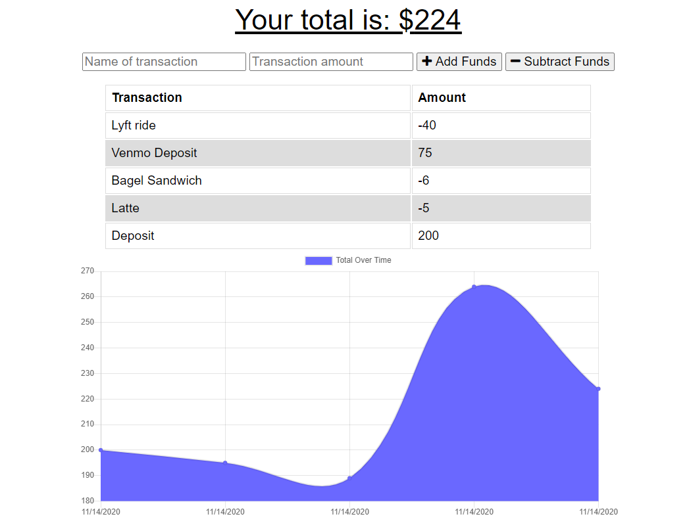
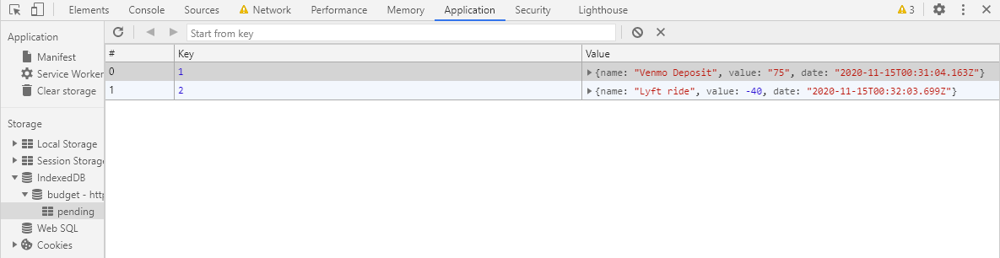

# Budget_Tracker

[Link to live site on Heroku](https://stark-wildwood-56659.herokuapp.com/)

## Description

This is a progressive web application that allows users to add deposits and withdrawals from a budget tracker while both online and offline. When the user is offline, the pending transactions are stored until the user is brought back online. Using the Developer Tools, you can simulate the user being offline and see that the pending transactions are stored in an IndexedDB that will be added to MongoDB Atlas once back online.

## Tech Stack

- Node.js
- MongoDB
- Mongoose
- Express
- Charts.js
- HTML 5
- CSS 3

## License

This application is covered under the MIT License.

## Credits
This project was prompted by a homework assignment through Trilogy Education Services. Some of the code used in this application was provided as part of the assignment.

## Questions
If you have further questions, please feel free to reach me at nckoller@gmail.com.